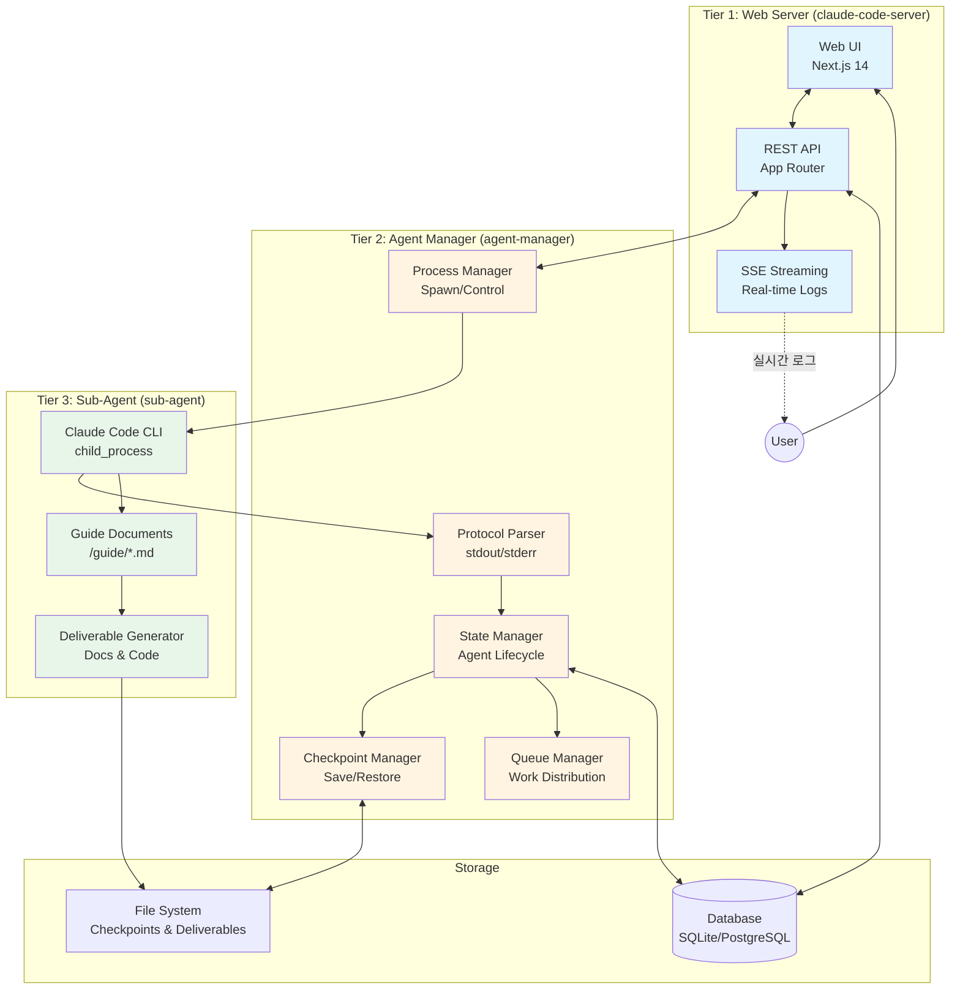
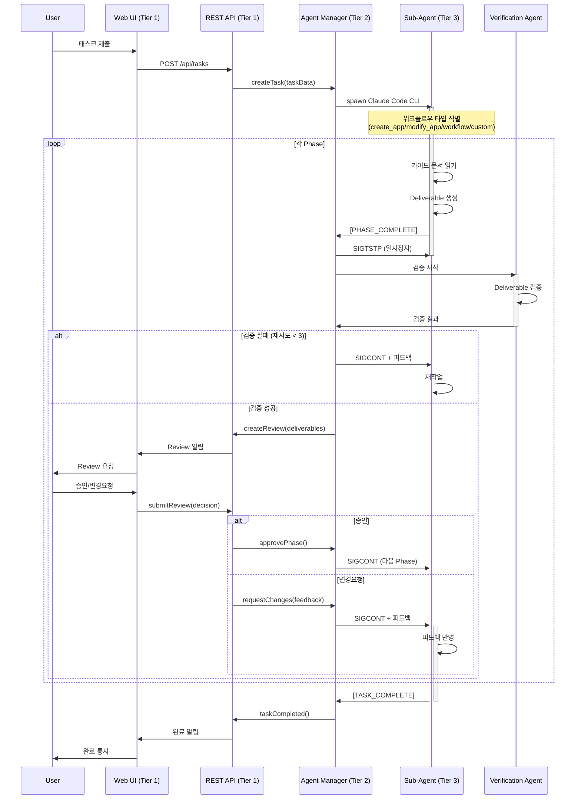
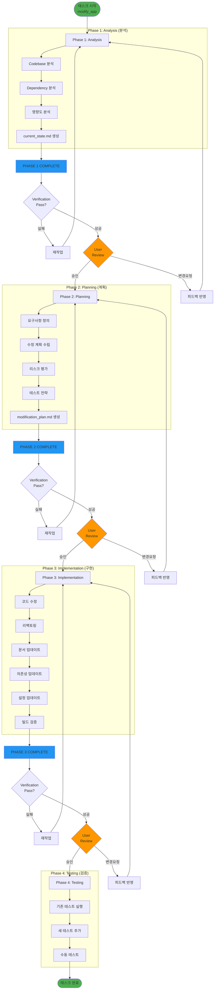
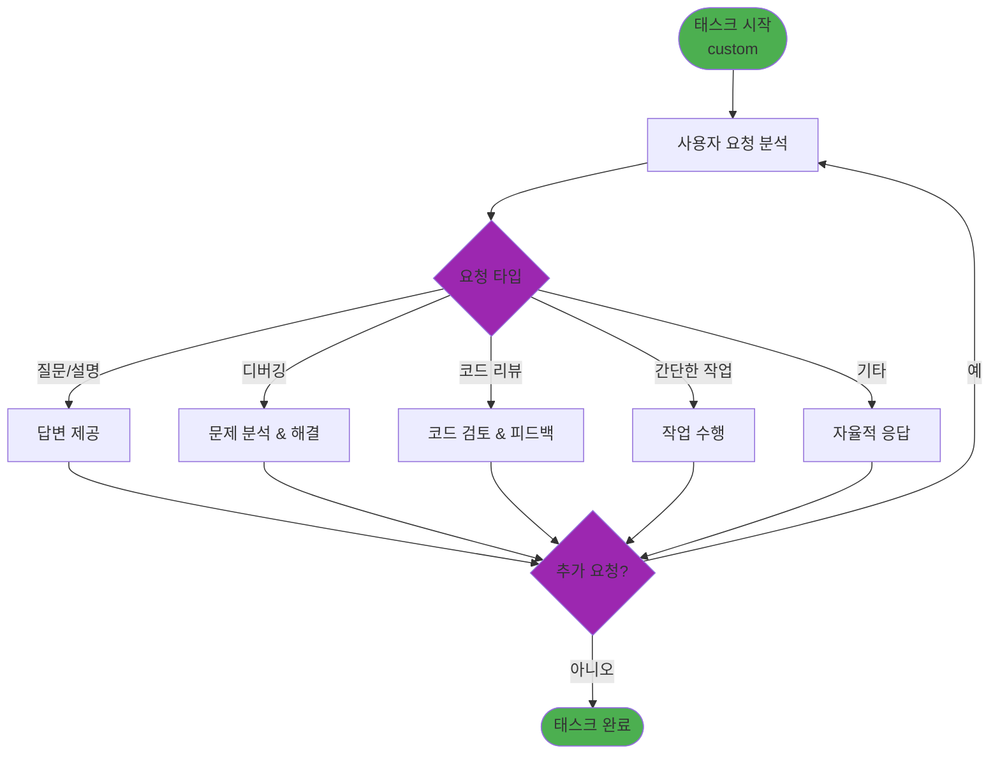
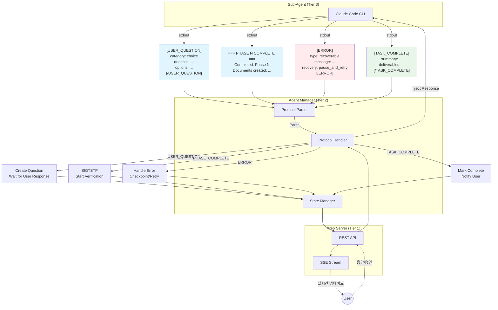
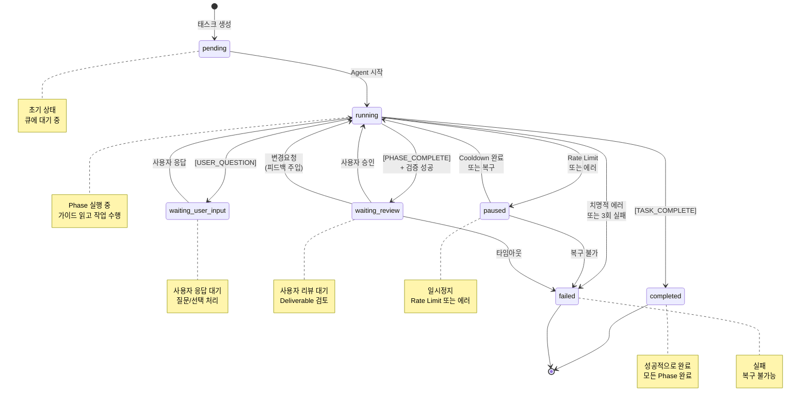
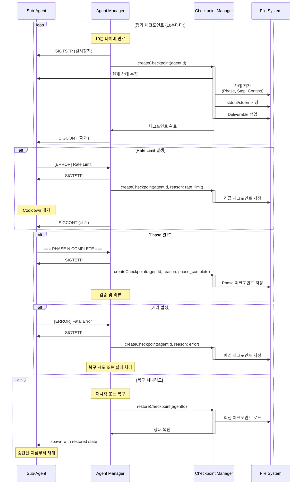
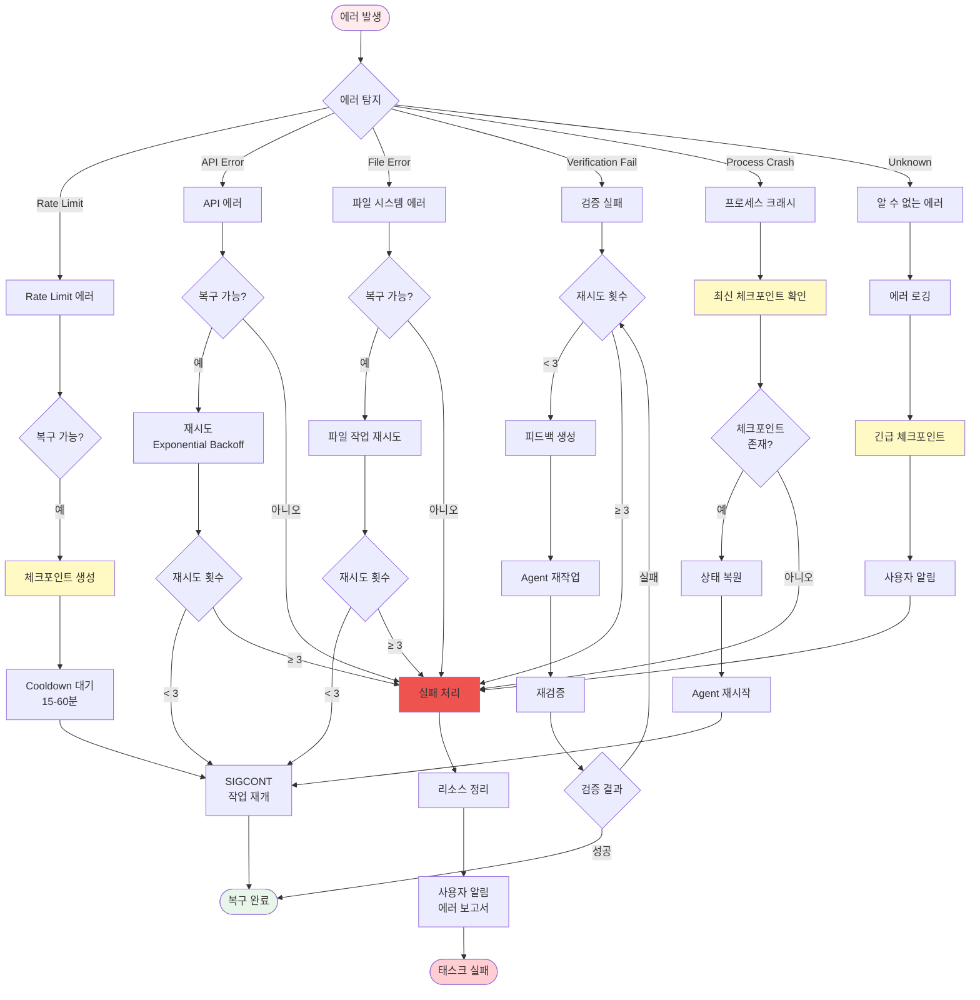

# System Flows

이 문서는 Claude Code Server 프로젝트의 모든 시스템 플로우를 Mermaid 다이어그램으로 정리합니다.

## 목차

1. [전체 시스템 아키텍처](#1-전체-시스템-아키텍처)
2. [전체 태스크 실행 플로우](#2-전체-태스크-실행-플로우)
3. [워크플로우 타입별 플로우](#3-워크플로우-타입별-플로우)
   - [Phase-A: create_app](#phase-a-create_app)
   - [Phase-B: modify_app](#phase-b-modify_app)
   - [Phase-C: workflow](#phase-c-workflow)
   - [Type-D: custom](#type-d-custom)
4. [리뷰 게이트 시스템](#4-리뷰-게이트-시스템)
5. [프로토콜 통신 플로우](#5-프로토콜-통신-플로우)
6. [에이전트 상태 머신](#6-에이전트-상태-머신)
7. [체크포인트 시스템](#7-체크포인트-시스템)
8. [에러 핸들링 플로우](#8-에러-핸들링-플로우)

---

## 1. 전체 시스템 아키텍처



**설명:**
- **Tier 1 (파란색)**: 사용자 인터페이스와 API 서버
- **Tier 2 (노란색)**: 에이전트 프로세스 관리 및 통신 처리
- **Tier 3 (초록색)**: 실제 작업 수행하는 Claude Code CLI 인스턴스

---

## 2. 전체 태스크 실행 플로우



**주요 단계:**
1. 사용자가 태스크 제출
2. Sub-Agent가 워크플로우 타입에 따라 Phase 실행
3. 각 Phase 완료 후 자동 검증
4. 검증 통과 시 사용자 리뷰
5. 승인 시 다음 Phase 진행
6. 모든 Phase 완료 시 태스크 종료

---

## 3. 워크플로우 타입별 플로우

### Phase-A: create_app

```mermaid
graph TD
    Start([태스크 시작<br/>create_app]) --> ReadGuides1[Planning 가이드 읽기<br/>9개 문서]

    ReadGuides1 --> Phase1[Phase 1: Planning]

    subgraph "Phase 1: Planning (기획)"
        Phase1 --> P1_1[01_idea.md 생성]
        P1_1 --> P1_2[02_market.md 생성]
        P1_2 --> P1_3[03_persona.md 생성]
        P1_3 --> P1_4[04_user_journey.md 생성]
        P1_4 --> P1_5[05_business_model.md 생성]
        P1_5 --> P1_6[06_product.md 생성]
        P1_6 --> P1_7[07_features.md 생성]
        P1_7 --> P1_8[08_tech.md 생성]
        P1_8 --> P1_9[09_roadmap.md 생성]
    end

    P1_9 --> Complete1[PHASE 1 COMPLETE]
    Complete1 --> Verify1{Verification<br/>Pass?}

    Verify1 -->|실패| Rework1[재작업<br/>최대 3회]
    Rework1 --> Phase1

    Verify1 -->|성공| Review1{User<br/>Review}
    Review1 -->|변경요청| Change1[피드백 반영]
    Change1 --> Phase1

    Review1 -->|승인| ReadGuides2[Design 가이드 읽기<br/>5개 문서]

    ReadGuides2 --> Phase2[Phase 2: Design]

    subgraph "Phase 2: Design (설계)"
        Phase2 --> P2_1[01_screen.md 생성]
        P2_1 --> P2_2[02_data_model.md 생성]
        P2_2 --> P2_3[03_task_flow.md 생성]
        P2_3 --> P2_4[04_api.md 생성]
        P2_4 --> P2_5[05_architecture.md 생성]
    end

    P2_5 --> Complete2[PHASE 2 COMPLETE]
    Complete2 --> Verify2{Verification<br/>Pass?}

    Verify2 -->|실패| Rework2[재작업<br/>최대 3회]
    Rework2 --> Phase2

    Verify2 -->|성공| Review2{User<br/>Review}
    Review2 -->|변경요청| Change2[피드백 반영]
    Change2 --> Phase2

    Review2 -->|승인| ReadGuides3[Development 가이드 읽기<br/>6개 문서]

    ReadGuides3 --> Phase3[Phase 3: Development]

    subgraph "Phase 3: Development (개발)"
        Phase3 --> P3_1[프로젝트 Setup]
        P3_1 --> P3_2[데이터 모델 구현]
        P3_2 --> P3_3[비즈니스 로직 구현]
        P3_3 --> P3_4[UI 구현]
        P3_4 --> P3_5[테스트 작성]
        P3_5 --> P3_6[배포 설정]
    end

    P3_6 --> Complete3[PHASE 3 COMPLETE]
    Complete3 --> Verify3{Verification<br/>Pass?}

    Verify3 -->|실패| Rework3[재작업<br/>최대 3회]
    Rework3 --> Phase3

    Verify3 -->|성공| Review3{User<br/>Review}
    Review3 -->|변경요청| Change3[피드백 반영]
    Change3 --> Phase3

    Review3 -->|승인| Phase4[Phase 4: Testing]

    subgraph "Phase 4: Testing (테스트)"
        Phase4 --> P4_1[최종 검증]
        P4_1 --> P4_2[품질 보증]
    end

    P4_2 --> End([태스크 완료])

    style Start fill:#4caf50
    style End fill:#4caf50
    style Complete1 fill:#2196f3
    style Complete2 fill:#2196f3
    style Complete3 fill:#2196f3
    style Review1 fill:#ff9800
    style Review2 fill:#ff9800
    style Review3 fill:#ff9800
```



**특징:**
- 9개 Planning 문서 → 5개 Design 문서 → 완전한 Codebase
- 각 Phase 후 검증 및 사용자 리뷰
- 총 14개 문서 + 완전한 앱

### Phase-B: modify_app



**특징:**
- 기존 코드 분석 → 수정 계획 → 구현 → 테스트
- Breaking change 방지에 중점
- 2개 분석 문서 + 수정된 코드

### Phase-C: workflow

```mermaid
graph TD
    Start([태스크 시작<br/>workflow]) --> Phase1[Phase 1: Planning]

    subgraph "Phase 1: Planning (기획)"
        Phase1 --> P1_1[워크플로우 요구사항 정의]
        P1_1 --> P1_2[트리거 정의<br/>schedule/webhook/manual/event]
        P1_2 --> P1_3[통합 요구사항<br/>외부 서비스]
        P1_3 --> P1_4[에러 처리 전략]
        P1_4 --> P1_5[스케줄링 요구사항]
        P1_5 --> P1_Doc[workflow_requirements.md 생성]
    end

    P1_Doc --> Complete1[PHASE 1 COMPLETE]
    Complete1 --> Verify1{Verification<br/>Pass?}

    Verify1 -->|실패| Rework1[재작업]
    Rework1 --> Phase1

    Verify1 -->|성공| Review1{User<br/>Review}
    Review1 -->|변경요청| Change1[피드백 반영]
    Change1 --> Phase1

    Review1 -->|승인| Phase2[Phase 2: Design]

    subgraph "Phase 2: Design (설계)"
        Phase2 --> P2_1[워크플로우 로직 설계]
        P2_1 --> P2_2[Step 정의<br/>actions/conditions]
        P2_2 --> P2_3[조건문 & 반복문 설계]
        P2_3 --> P2_4[상태 관리 설계]
        P2_4 --> P2_5[통합 패턴 정의]
        P2_5 --> P2_Doc[workflow_design.md 생성]
    end

    P2_Doc --> Complete2[PHASE 2 COMPLETE]
    Complete2 --> Verify2{Verification<br/>Pass?}

    Verify2 -->|실패| Rework2[재작업]
    Rework2 --> Phase2

    Verify2 -->|성공| Review2{User<br/>Review}
    Review2 -->|변경요청| Change2[피드백 반영]
    Change2 --> Phase2

    Review2 -->|승인| Phase3[Phase 3: Development]

    subgraph "Phase 3: Development (개발)"
        Phase3 --> P3_1[트리거 구현]
        P3_1 --> P3_2[액션 핸들러 구현]
        P3_2 --> P3_3[통합 커넥터 구현]
        P3_3 --> P3_4[에러 처리 구현]
        P3_4 --> P3_5[상태 관리 구현]
        P3_5 --> P3_6[로깅 & 모니터링]
    end

    P3_6 --> Complete3[PHASE 3 COMPLETE]
    Complete3 --> Verify3{Verification<br/>Pass?}

    Verify3 -->|실패| Rework3[재작업]
    Rework3 --> Phase3

    Verify3 -->|성공| Review3{User<br/>Review}
    Review3 -->|변경요청| Change3[피드백 반영]
    Change3 --> Phase3

    Review3 -->|승인| Phase4[Phase 4: Testing]

    subgraph "Phase 4: Testing (테스트)"
        Phase4 --> P4_1[트리거 테스트]
        P4_1 --> P4_2[End-to-End 테스트]
        P4_2 --> P4_3[에러 시나리오 테스트]
        P4_3 --> P4_4[통합 테스트]
    end

    P4_4 --> End([태스크 완료])

    style Start fill:#4caf50
    style End fill:#4caf50
    style Complete1 fill:#2196f3
    style Complete2 fill:#2196f3
    style Complete3 fill:#2196f3
    style Review1 fill:#ff9800
    style Review2 fill:#ff9800
    style Review3 fill:#ff9800
```



**특징:**
- 워크플로우 자동화에 특화
- 트리거, 통합, 에러 처리에 중점
- 2개 워크플로우 문서 + 워크플로우 코드

### Type-D: custom



**특징:**
- 고정된 Phase 없음
- 자연스러운 대화형 처리
- 검증 및 리뷰 게이트 없음
- 사용자 만족도 중심

---

## 4. 리뷰 게이트 시스템

```mermaid
sequenceDiagram
    participant Agent as Sub-Agent
    participant Mgr as Agent Manager
    participant Verify as Verification Agent
    participant API as Web Server
    participant User

    Agent->>Agent: Phase 작업 수행
    Agent->>Mgr: === PHASE N COMPLETE ===

    Note over Mgr: Agent 일시정지 (SIGTSTP)
    Mgr->>Mgr: Deliverable 수집

    Mgr->>Verify: spawn verification agent
    activate Verify

    Verify->>Verify: 파일 존재 확인
    Verify->>Verify: 내용 길이 확인 (≥500 chars)
    Verify->>Verify: Placeholder 검사
    Verify->>Verify: 품질 평가

    alt 검증 실패 & 재시도 < 3
        Verify->>Mgr: 검증 실패 (피드백)
        deactivate Verify
        Mgr->>Agent: SIGCONT + 피드백
        Note over Agent: 피드백 반영 후 재작업
        Agent->>Mgr: === PHASE N COMPLETE === (재제출)
        Mgr->>Verify: spawn verification agent (재검증)
        activate Verify
    else 검증 성공
        Verify->>Mgr: 검증 성공
        deactivate Verify
        Mgr->>API: createReview(phase, deliverables)
        API->>User: Review 요청 알림

        User->>User: Deliverable 검토

        alt 승인
            User->>API: approve()
            API->>Mgr: approvePhase()
            Mgr->>Agent: SIGCONT (다음 Phase)
            Note over Agent: 다음 Phase 시작
        else 변경 요청
            User->>API: requestChanges(feedback)
            API->>Mgr: requestChanges(feedback)
            Mgr->>Agent: SIGCONT + 피드백
            Note over Agent: 피드백 반영 후 재작업
            Agent->>Mgr: === PHASE N COMPLETE === (재제출)
            Mgr->>Verify: spawn verification agent (재검증)
            activate Verify
            Verify->>Mgr: 검증 결과
            deactivate Verify
        end
    else 검증 실패 & 재시도 = 3
        Verify->>Mgr: 최종 검증 실패
        deactivate Verify
        Mgr->>API: taskFailed(reason)
        API->>User: 실패 알림
    end
```

**주요 단계:**
1. Phase 완료 신호 수신
2. Agent 일시정지 (SIGTSTP)
3. Verification Agent 자동 실행
4. 검증 실패 시 최대 3회 재시도
5. 검증 성공 시 사용자 리뷰 생성
6. 사용자 승인/변경요청 처리

---

## 5. 프로토콜 통신 플로우



**주요 프로토콜:**
1. **USER_QUESTION**: 사용자 입력 요청
2. **PHASE_COMPLETE**: Phase 완료 신호
3. **ERROR**: 에러 보고 및 복구 전략
4. **TASK_COMPLETE**: 전체 태스크 완료

---

## 6. 에이전트 상태 머신



**상태 설명:**
- **pending**: 태스크가 생성되었으나 아직 시작되지 않음
- **running**: Agent가 활발히 작업 수행 중
- **waiting_user_input**: 사용자 응답 대기 (질문/선택)
- **waiting_review**: 사용자 리뷰 대기 (Phase 완료 후)
- **paused**: 일시정지 (Rate Limit, 에러, Checkpoint)
- **completed**: 성공적으로 완료
- **failed**: 실패 (복구 불가능)

---

## 7. 체크포인트 시스템



**체크포인트 트리거:**
1. **정기**: 10분마다 자동 저장
2. **Rate Limit**: API 제한 발생 시
3. **Phase 완료**: 각 Phase 완료 후
4. **에러**: 복구 가능한 에러 발생 시

**저장 내용:**
- 현재 Phase/Step
- Agent 컨텍스트 (conversation history)
- stdout/stderr 로그
- 생성된 Deliverable

---

## 8. 에러 핸들링 플로우



**에러 타입별 처리:**

1. **Rate Limit**
   - 체크포인트 생성 → Cooldown 대기 → 재개
   - 자동 복구

2. **API Error**
   - Exponential Backoff으로 재시도
   - 최대 3회 시도 후 실패

3. **File Error**
   - 파일 작업 재시도
   - 최대 3회 시도 후 실패

4. **Verification Fail**
   - 피드백 생성 → Agent 재작업
   - 최대 3회 재시도 후 실패

5. **Process Crash**
   - 체크포인트 복원 → Agent 재시작
   - 체크포인트 없으면 실패

6. **Unknown Error**
   - 긴급 체크포인트 → 에러 로깅 → 실패

---

## 요약

### 주요 플로우 체크리스트

1. **시스템 이해를 위한 순서**:
   ```
   1. 전체 시스템 아키텍처 (3-tier)
      ↓
   2. 전체 태스크 실행 플로우
      ↓
   3. 워크플로우 타입 선택 및 이해
      ↓
   4. 리뷰 게이트 시스템
      ↓
   5. 프로토콜 통신
      ↓
   6. 에이전트 상태 머신
      ↓
   7. 체크포인트 & 에러 핸들링
   ```

2. **워크플로우 타입 선택 가이드**:
   - **새 앱 만들기** → Phase-A (create_app)
   - **기존 앱 수정** → Phase-B (modify_app)
   - **자동화 워크플로우** → Phase-C (workflow)
   - **간단한 질문/작업** → Type-D (custom)

3. **핵심 개념**:
   - **3-tier 아키텍처**: Web Server → Agent Manager → Sub-Agent
   - **Phase-based 실행**: 각 Phase 후 검증 및 리뷰
   - **Protocol 통신**: stdout을 통한 구조화된 메시지
   - **Checkpoint 시스템**: 정기적 상태 저장 및 복구
   - **Review Gate**: 자동 검증 + 사용자 승인

4. **추가 참고 문서**:
   - `docs/ARCHITECTURE.md` - 상세 아키텍처
   - `docs/WORKFLOWS.md` - 워크플로우 상세
   - `docs/PROTOCOLS.md` - 프로토콜 상세
   - `docs/STATE_MACHINE.md` - 상태 전이 상세
   - `docs/CHECKPOINT_SYSTEM.md` - 체크포인트 상세

---

**문서 버전**: 1.0
**마지막 업데이트**: 2025-01-XX
**관리자**: Claude Code Server Team
