# System Diagrams (시스템 다이어그램)

이 문서는 Claude Code Server의 주요 워크플로우를 시각적으로 표현합니다.

---

## 1. Task 실행 전체 흐름

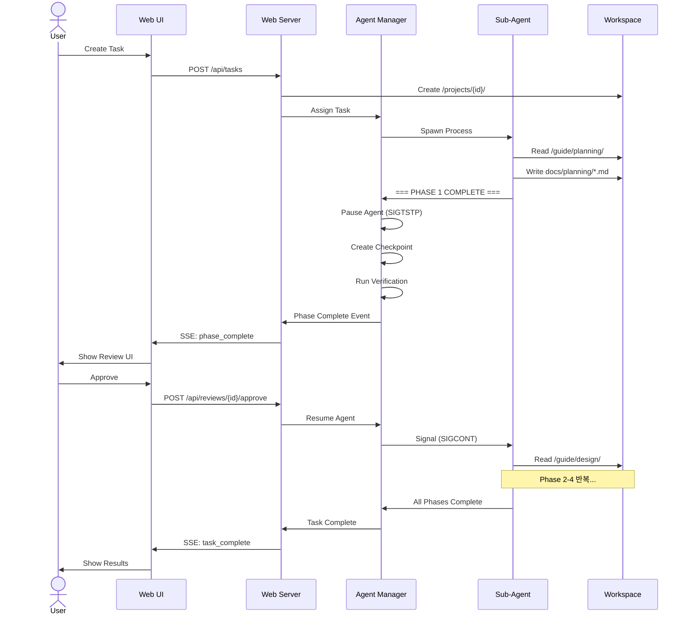

---

## 2. Review Gate 프로세스

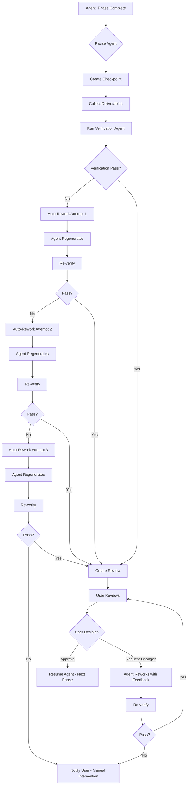

---

## 3. 의존성 요청 흐름

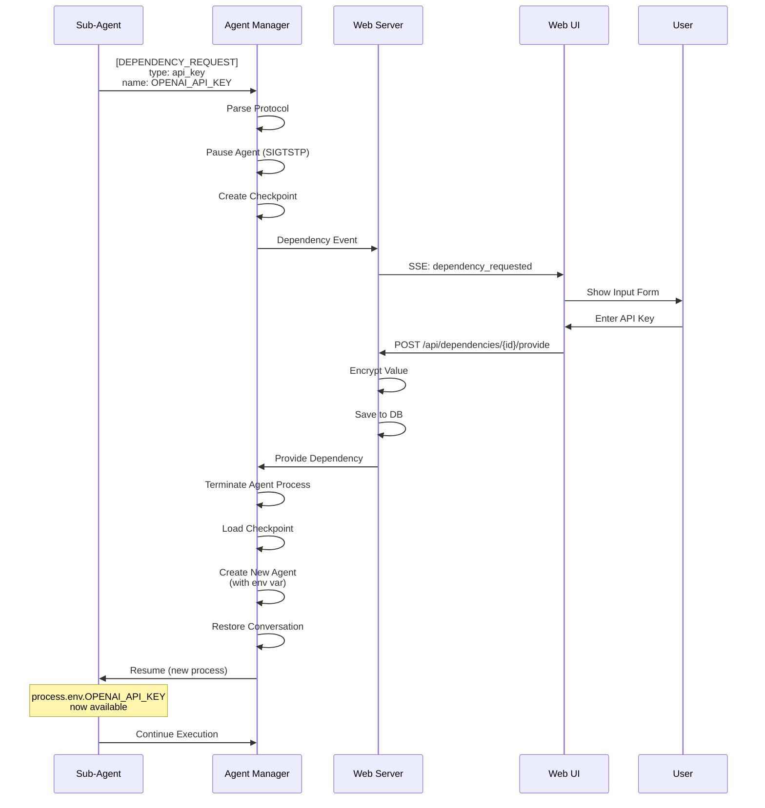

---

## 4. Checkpoint 생성 및 복구

```mermaid
flowchart LR
    subgraph Creation[Checkpoint 생성]
        A1[Trigger:<br/>10분 경과 /<br/>Rate Limit /<br/>Error /<br/>Phase Complete] --> A2[Collect Agent State]
        A2 --> A3[Collect Conversation History]
        A3 --> A4[Collect Environment Variables]
        A4 --> A5[Scan Workspace]
        A5 --> A6[Create Checkpoint JSON]
        A6 --> A7[Save to<br/>.checkpoints/]
    end

    subgraph Recovery[Checkpoint 복구]
        B1[System Restart /<br/>Rate Limit Reset /<br/>User Resume] --> B2[Load Latest Checkpoint]
        B2 --> B3[Validate Workspace]
        B3 --> B4[Create Agent Process]
        B4 --> B5[Inject Environment Variables]
        B5 --> B6[Restore Conversation History]
        B6 --> B7[Resume Agent<br/>(SIGCONT)]
    end

    Creation --> Recovery
```

---

## 5. Rate Limit 처리

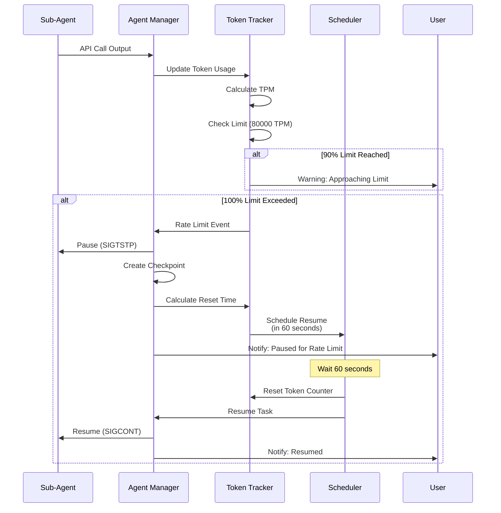

---

## 6. 3-Tier 아키텍처

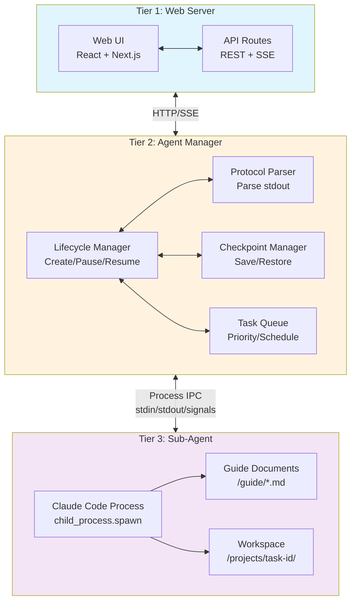

---

## 7. Task 상태 전이

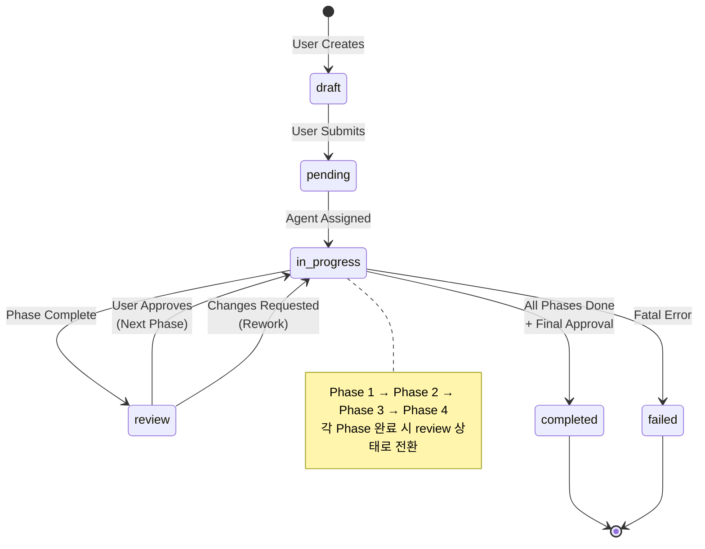

---

## 8. Agent 상태 전이

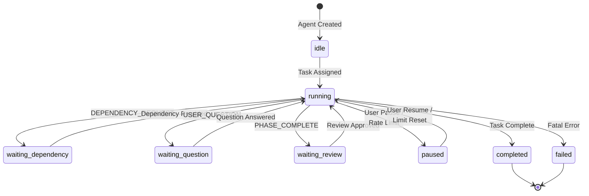

---

## 9. 사용자 질문 처리

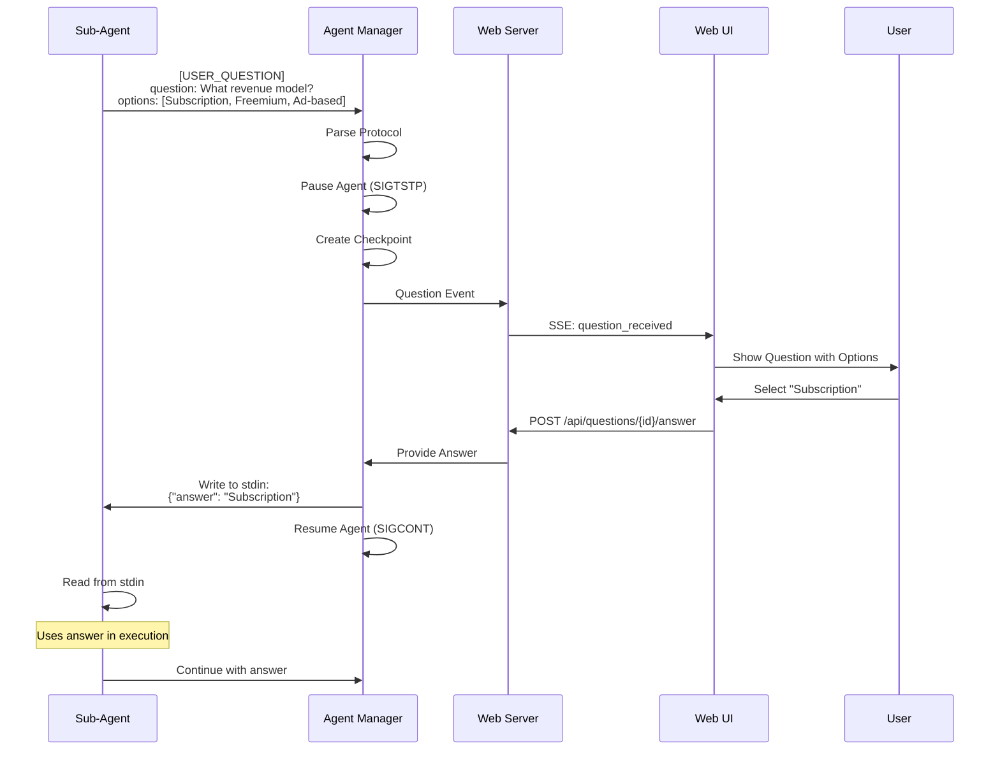

---

## 10. 검증 프로세스

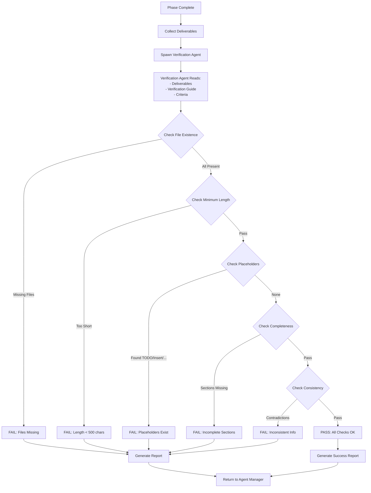

---

## 11. 시스템 부트스트랩 (재시작 복구)

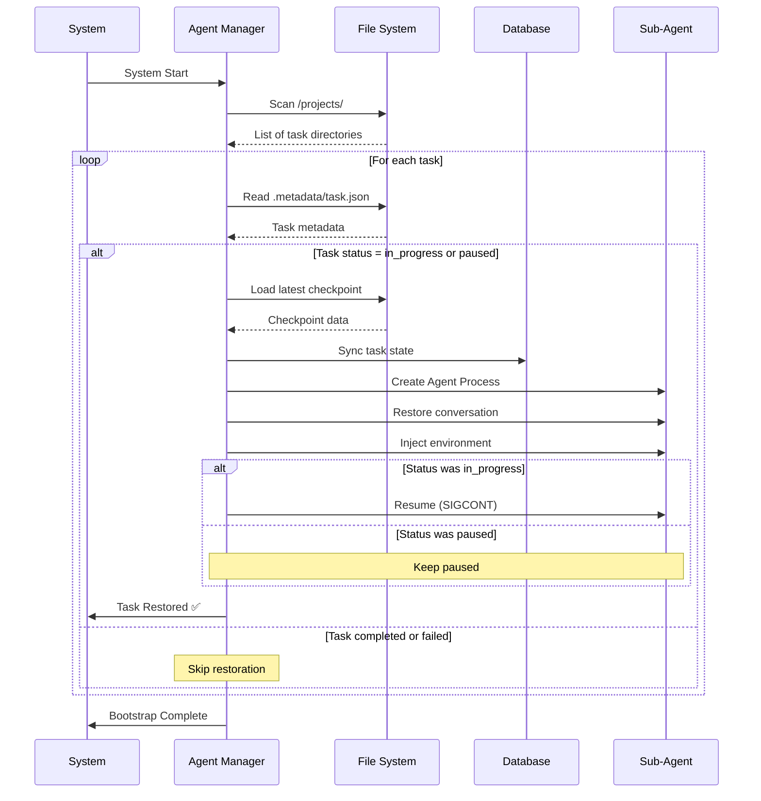

---

## 12. SSE 스트리밍

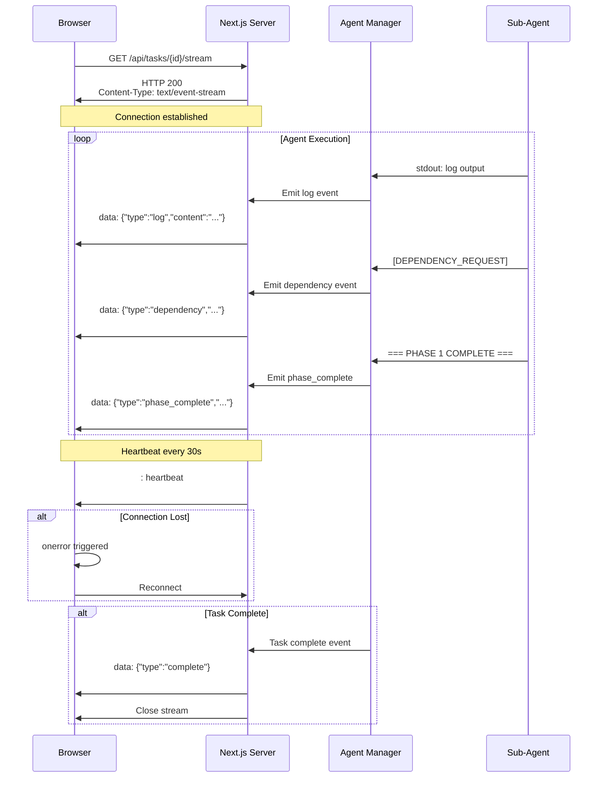

---

## 다이어그램 사용 가이드

### Mermaid 렌더링

이 문서의 다이어그램은 [Mermaid](https://mermaid.js.org/)로 작성되었습니다.

**지원 플랫폼**:
- GitHub (자동 렌더링)
- VS Code (Markdown Preview Mermaid Support 확장)
- Notion
- Obsidian

**로컬 렌더링**:
```bash
# Mermaid CLI 설치
npm install -g @mermaid-js/mermaid-cli

# PNG 생성
mmdc -i docs/DIAGRAMS.md -o docs/diagrams.png
```

---

## 관련 문서

- **워크플로우**: `/docs/WORKFLOWS.md`
- **상태 기계**: `/docs/STATE_MACHINE.md`
- **프로토콜**: `/docs/PROTOCOLS.md`
- **아키텍처**: `/docs/ARCHITECTURE.md`

---

**최종 업데이트**: 2024-02-15
**버전**: 1.0
