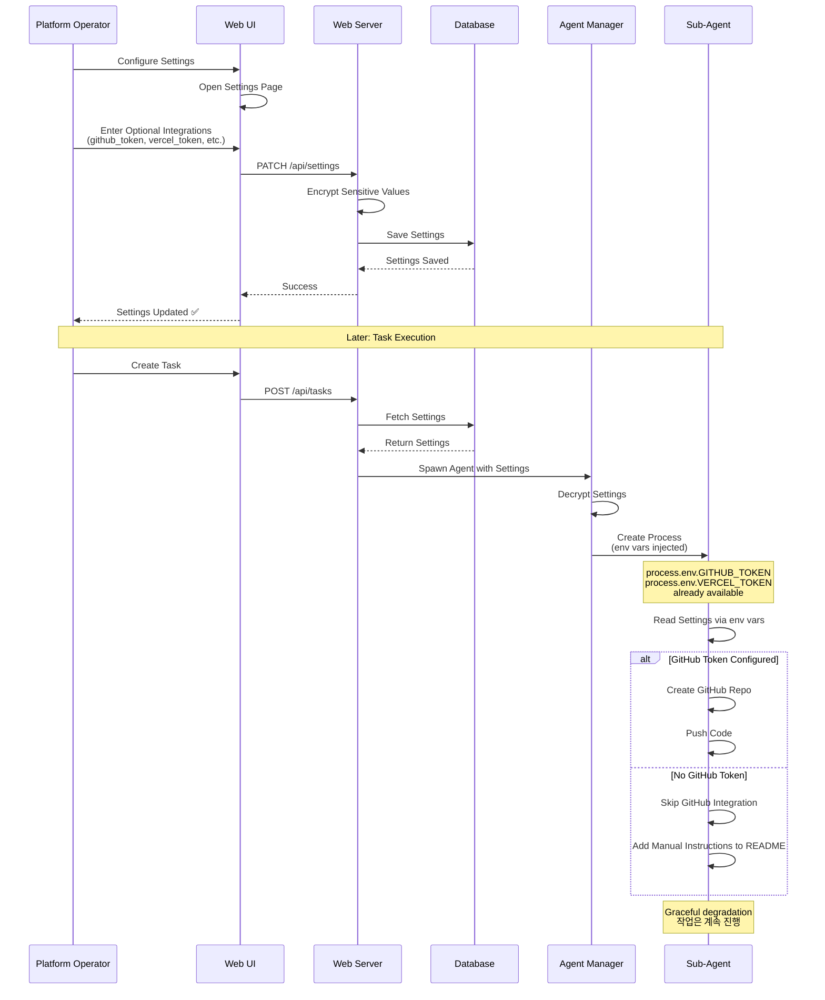

# System Diagrams (시스템 다이어그램)

이 문서는 Claude Code Server의 주요 워크플로우를 시각적으로 표현합니다.

## 포함된 다이어그램 (12개)

1. **Task 실행 전체 흐름** - 작업 생성부터 완료까지의 전체 프로세스
2. **Review Gate 프로세스** - Phase 완료 후 검증 및 리뷰 절차
3. **Settings 시스템** - 설정 사전 구성 및 환경 변수 주입 (✨ NEW)
4. **Checkpoint 생성 및 복구** - 상태 저장 및 복원 메커니즘
5. **Rate Limit 처리** - API 사용량 제한 감지 및 자동 재개
6. **3-Tier 아키텍처** - 시스템 계층 구조 및 컴포넌트
7. **Task 상태 전이** - 작업의 생명주기 상태 변화
8. **Agent 상태 전이** - 에이전트의 실행 상태 변화
9. **사용자 질문 처리** - 에이전트의 질문 및 응답 흐름
10. **검증 프로세스** - 산출물 품질 검사 절차
11. **시스템 부트스트랩** - 재시작 시 복구 프로세스
12. **SSE 스트리밍** - 실시간 로그 스트리밍

---

## 1. Task 실행 전체 흐름


---

## 2. Review Gate 프로세스


---

## 3. Settings 시스템 (설정 사전 구성)



> **⚠️ 참고**: 이전에 사용되던 DEPENDENCY_REQUEST 프로토콜은 deprecated되었습니다. 현재는 Settings 시스템을 통해 사전에 설정을 구성합니다. 자세한 내용은 [SETTINGS_SYSTEM.md](SETTINGS_SYSTEM.md)와 [DEPENDENCY_SYSTEM.md](DEPENDENCY_SYSTEM.md) (deprecated) 참조.

---

## 4. Checkpoint 생성 및 복구

```mermaid
flowchart LR
    subgraph Creation[Checkpoint 생성]
        A1[Trigger:<br/>10분 경과 /<br/>Rate Limit /<br/>Error /<br/>Phase Complete] --> A2[Collect Agent State]
        A2 --> A3[Collect Conversation History]
        A3 --> A4[Collect Environment Variables]
        A4 --> A5[Scan Workspace]
        A5 --> A6[Create Checkpoint JSON]
        A6 --> A7[Save to<br/>.checkpoints/]
    end

    subgraph Recovery[Checkpoint 복구]
        B1[System Restart /<br/>Rate Limit Reset /<br/>User Resume] --> B2[Load Latest Checkpoint]
        B2 --> B3[Validate Workspace]
        B3 --> B4[Create Agent Process]
        B4 --> B5[Inject Environment Variables]
        B5 --> B6[Restore Conversation History]
        B6 --> B7[Resume Agent<br/>(SIGCONT)]
    end

    Creation --> Recovery
```

---

## 5. Rate Limit 처리


---

## 6. 3-Tier 아키텍처


---

## 7. Task 상태 전이


---

## 8. Agent 상태 전이


---

## 9. 사용자 질문 처리


---

## 10. 검증 프로세스


---

## 11. 시스템 부트스트랩 (재시작 복구)


---

## 12. SSE 스트리밍


---

## 다이어그램 사용 가이드

### Mermaid 렌더링

이 문서의 다이어그램은 [Mermaid](https://mermaid.js.org/)로 작성되었습니다.

**지원 플랫폼**:
- GitHub (자동 렌더링)
- VS Code (Markdown Preview Mermaid Support 확장)
- Notion
- Obsidian

**로컬 렌더링**:
```bash
# Mermaid CLI 설치
npm install -g @mermaid-js/mermaid-cli

# PNG 생성
mmdc -i docs/DIAGRAMS.md -o docs/diagrams.png
```

---

## 관련 문서

- **워크플로우**: `/docs/WORKFLOWS.md`
- **상태 기계**: `/docs/STATE_MACHINE.md`
- **프로토콜**: `/docs/PROTOCOLS.md`
- **아키텍처**: `/docs/ARCHITECTURE.md`

---

**최종 업데이트**: 2025-02-07
**버전**: 2.0 (Settings 시스템 다이어그램 추가, Deprecated 시스템 제거)
